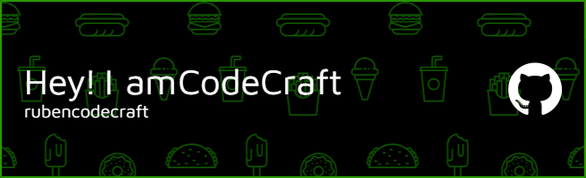

#  Welcome to CodeCraft's GitHub

🌍 Remote Full-Stack Developer & Visual Creative | Let’s Build Something Awesome Together
Hi! I'm a multi-skilled freelancer with a passion for creating powerful digital experiences and visually compelling content. I specialize in:
## 🚀 What I Do  
### 💼 (A glimpse into my creative and technical services)

- **Web Development**  
  HTML, CSS, JavaScript, React

- **Mobile App Development**  
  Flutter, React Native

- **Graphic Design**  
  Branding, Social Media, UI/UX

- **Video Editing**  
  YouTube, Ads, Reels

I work remotely, speak fluent design and code, and love bringing ideas to life.
🎯 Whether you need a new website, a mobile app, stunning graphics, or a polished video — I can help deliver high-quality results, on time and within budget.
Let’s connect and bring your vision to life!

## 💻Skills
### Core

### Scripting

### Code Editors

                    
### Frontend

### Backend and DataBase

### Software 

                    
### Web3 

### Cloud 

                    
### CMS 

### Other 

<!-- BEGIN YOUTUBE-CARDS -->
<!-- END YOUTUBE-CARDS -->

